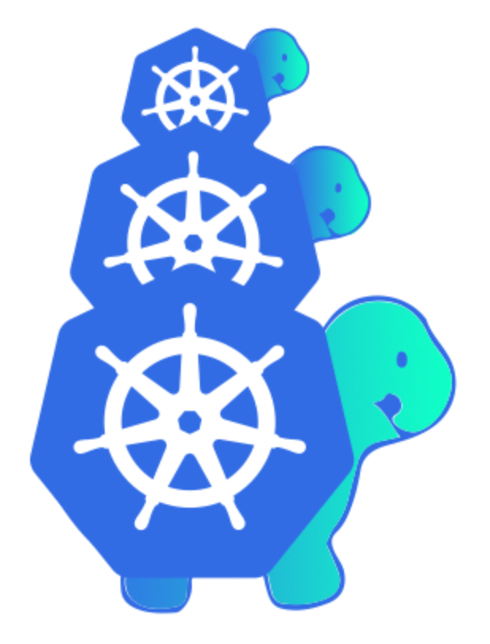

# Vorstellungsrunde

Bitte stellt euch kurz vor:

- **Name** Yannik Dällenbach
- **Wo arbeitet ihr?** bespinian, vorher Puzzle ITC
- **Wieso Kubernetes/Cluster API?** Grosser Fan der Kubernetes Architektur!

<!-- end_slide -->

# Was ist die Cluster API?

<!-- column_layout: [2, 1] -->
<!-- column: 0 -->

Kubernetes-Projekt der SIG Cluster Lifecycle

Definiert **CRDs und Controller** für Cluster-Management

---

## Kernidee

> Ein Kubernetes-Cluster erzeugt andere Kubernetes-Cluster.
> Alles läuft deklarativ über YAML.

<!-- column: 1 -->



<!-- end_slide -->

# Management vs. Workload Cluster

```mermaid +render +width:60%
graph LR
    A[Management Cluster<br/>• Cluster API<br/>• Controller<br/>• CRDs] -->|verwaltet| B[Workload Cluster<br/>• Anwendungen<br/>• Services<br/>• Pods]
```

<!-- end_slide -->

# Was macht CAPI?

| Funktion                       | Beschreibung                     |
| :----------------------------- | :------------------------------- |
| **Cluster erzeugen**           | Deklarativ mit YAML              |
| **Cluster ändern**             | Automatisch durch Reconciliation |
| **Cluster löschen**            | Durch `kubectl delete`           |
| **Nodes verwalten**            | Über Machine-Ressourcen          |
| **Infrastruktur abstrahieren** | Provider für AWS, Azure, Docker  |

<!-- end_slide -->

# Was macht CAPI NICHT?

- ❌ Betreibt keine Cluster (Monitoring/Logging)
- ❌ Verpackt keine Workloads
- ❌ Verwaltet Cluster-Inhalte
- ❌ Ersetzt GitOps

**CAPI verwaltet nur die Cluster-Hülle**

<!-- end_slide -->

# Vorher vs. Nachher

## Früher: Neues Staging-Cluster

1. AWS-Konsole öffnen
2. EC2-Instanzen manuell erstellen
3. kubeadm auf jeder Maschine ausführen
4. Join-Befehle kopieren
5. **2 Stunden später**: Cluster läuft (hoffentlich)

---

<!-- pause -->

## Mit CAPI: Neues Staging-Cluster

1. YAML schreiben (5 Minuten)
2. `kubectl apply -f cluster.yaml`
3. **10 Minuten später**: Cluster läuft

<!-- end_slide -->

# Warum gibt es CAPI?

## Probleme ohne CAPI

- Cluster per Skript oder manuell erstellt
- Keine Standards zwischen Cloud-Anbietern
- Wartung schwer: Upgrades, Reparaturen manuell

## Vorteile mit CAPI

- **Wiederholbar**: Infrastruktur als Code
- **Deklarativ**: YAML wird Realität
- **Standardisiert**: Einheitliche Schnittstelle

<!-- end_slide -->

# Reconciliation Loop

```mermaid +render
graph TD
    A[Du definierst Zielzustand<br/>YAML] --> B[Controller erkennt<br/>Abweichung]
    B --> C[Controller gleicht aus<br/>Aktionen]
    C --> D[Überwachung<br/>Kontinuierlich]
    D --> B
```

**Beispiel:**

- Du: "Ich will 1 Control-Plane, 3 Worker"
- CAPI: erstellt, überwacht, repariert

<!-- end_slide -->

# Custom Resources (CRDs)

| CRD                   | Zweck                              |
| --------------------- | ---------------------------------- |
| **Cluster**           | Definiert einen Kubernetes-Cluster |
| **Machine**           | Definiert einen Node               |
| **MachineSet**        | Wie ReplicaSet für Maschinen       |
| **MachineDeployment** | Wie Deployment für Maschinen       |
| **ControlPlane**      | Verwaltet Control-Plane-Maschinen  |
| **BootstrapConfig**   | Konfiguration für Node-Setup       |

<!-- end_slide -->

# Controller-Übersicht

| Controller                   | Namespace            | Aufgabe                      |
| ---------------------------- | -------------------- | ---------------------------- |
| **capi-controller-manager**  | capi-system          | Cluster, Machine, MachineSet |
| **bootstrap-controller**     | bootstrap-system     | KubeadmConfig für Node-Setup |
| **control-plane-controller** | control-plane-system | KubeadmControlPlane          |

**Jeder Controller verwaltet "seine" CRDs**

<!-- end_slide -->

# Beispiel

## Lokales `kind` Cluster erstellen

```bash +exec
kind create cluster \
    --config=./example/kind-cluster-with-extramounts.yaml
```

<!-- end_slide -->

# Beispiel

## Cluster API installieren

```bash +exec
clusterctl init --infrastructure docker
```

<!-- end_slide -->

# Beispiel

## Namespaces

```bash +exec
kubectl get namespaces,deployments -A
```

<!-- end_slide -->

# Beispiel

`MachineTemplate` für unsere Control Plane.

Das Ziel einer InfraMachine-Ressource ist es, den Lebenszyklus von provider-spezifischen Maschinen-Instanzen zu verwalten.

Diese können physische oder virtuelle Instanzen sein und stellen die Infrastruktur für Kubernetes-Nodes dar.

```yaml +line_numbers
apiVersion: infrastructure.cluster.x-k8s.io/v1beta1
kind: DockerMachineTemplate
metadata:
  name: controlplane
  namespace: default
spec:
  template:
    spec: {}
```

---

```bash +exec
# Was kann als Template konfiguriert werden?
kubectl explain dockermachinetemplate.spec.template.spec
```

<!-- end_slide -->

# Beispiel

Unsere Control Plane soll mit `kubeadm` erstellt werden.

```yaml {all|7|8|9-14|all} +line_numbers
apiVersion: controlplane.cluster.x-k8s.io/v1beta1
kind: KubeadmControlPlane
metadata:
  name: controlplane
  namespace: default
spec:
  replicas: 1
  version: v1.33.0
  machineTemplate:
    infrastructureRef:
      apiVersion: infrastructure.cluster.x-k8s.io/v1beta1
      kind: DockerMachineTemplate
      name: controlplane
      namespace: default
```

<!-- end_slide -->

# Beispiel

Das Ziel einer InfraCluster-Ressource ist es, alle Voraussetzungen (in Bezug auf Infrastruktur) bereitzustellen, die für den Betrieb von Maschinen nötig sind.

Beispiele umfassen:

- Netzwerke
- Load Balancer
- Firewall-Regeln und so weiter.

```yaml +line_numbers
apiVersion: infrastructure.cluster.x-k8s.io/v1beta1
kind: DockerCluster
metadata:
  name: simple-cluster
  namespace: default
```

---

```bash +exec
kubectl explain dockercluster.spec
```

<!-- end_slide -->

# Beispiel

```yaml {all|7-11|12-16|all} +line_numbers
apiVersion: cluster.x-k8s.io/v1beta1
kind: Cluster
metadata:
  name: simple-cluster
  namespace: default
spec:
  controlPlaneRef:
    apiVersion: controlplane.cluster.x-k8s.io/v1beta1
    kind: KubeadmControlPlane
    name: controlplane
    namespace: default
  infrastructureRef:
    apiVersion: infrastructure.cluster.x-k8s.io/v1beta1
    kind: DockerCluster
    name: simple-cluster
    namespace: default
```

<!-- end_slide -->

# Beispiel

```bash +exec
kubectl apply -f ./example/simple-cluster.yaml
```

<!-- end_slide -->

# Beispiel

```bash +exec
kubectl get clusters,dockercluster,machine
```

<!-- end_slide -->

# Beispiel

```bash +exec
docker ps
```
